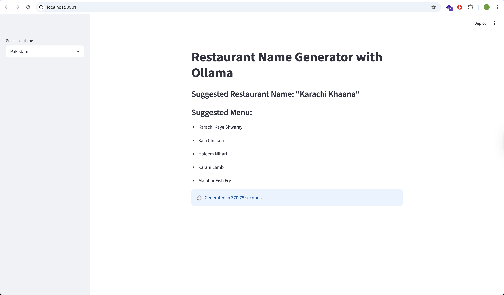

## Example Output

```
Selected cuisine: Pakistani
Generating restaurant name and menu for cuisine: Pakistani
Generating restaurant name... verbose=False prompt=PromptTemplate(input_variables=['cuisine'], input_types={}, partial_variables={}, template='I want to open a restaurant for a {cuisine} cuisine. Respond only with a single creative restaurant name, no explanation, no list, just the name.') llm=OllamaLLM(model='llama3', base_url='http://localhost:11434') output_key='restaurant_name' output_parser=StrOutputParser() llm_kwargs={}
Generating menu... verbose=False prompt=PromptTemplate(input_variables=['cuisine', 'restaurant_name'], input_types={}, partial_variables={}, template='Suggest 5 unique dishes for a {cuisine} restaurant named {restaurant_name}. Respond only with a comma-separated list of dish names, no explanation, no numbering, just the names.') llm=OllamaLLM(model='llama3', base_url='http://localhost:11434') output_key='menu' output_parser=StrOutputParser() llm_kwargs={}
Generated restaurant name and menu: {'cuisine': 'Pakistani', 'restaurant_name': '"Karachi Khaana"', 'menu': 'Karachi Kaye Shwaray, Sajji Chicken, Haleem Nihari, Karahi Lamb, Malabar Fish Fry'}
Generated response: {'cuisine': 'Pakistani', 'restaurant_name': '"Karachi Khaana"', 'menu': 'Karachi Kaye Shwaray, Sajji Chicken, Haleem Nihari, Karahi Lamb, Malabar Fish Fry'}
```



## Quickstart: Restaurant Name & Menu Generator

### 1. Start Ollama with Docker


```bash
docker compose up -d
# Pull your preferred model (e.g., llama3, mistral, phi3, etc.)
docker exec ollama ollama pull llama3
# Example for another model:
# docker exec ollama ollama pull mistral

# Run model 
# docker exec ollama ollama run llama3
```

You can use any Ollama-supported model based on your preference. Just update the model name in your code and pull the corresponding model as shown above.

### 2. Create and activate a virtual environment (recommended)

```bash
python3.12 -m venv .venv
source .venv/bin/activate
```

### 3. Install dependencies

```bash
pip install -r requirements.txt
```

### 4. Run the Streamlit app

```bash
streamlit run restaurant-name-generator/main.py
```

---

**Features:**
- Generates a creative restaurant name and menu for a selected cuisine using Ollama (llama3 model)
- Shows a loading spinner and total generation time
- Clean, concise output for easy copy-paste

**Requirements:**
- Docker (for Ollama)
- Python 3.12+
- Models and data are stored in the `volume/` folder

---

## Setup

### 1. Create a virtual environment (recommended)

```bash
python3.12 -m venv .venv
source .venv/bin/activate
```

### 2. Install dependencies

```bash
pip install -r requirements.txt
```

### 3. Start the Streamlit app

```bash
streamlit run app.py
```

---


This setup provides a pure Streamlit app using LangChain, Ollama, and (optionally) ChromaDB for interactive restaurant name and menu suggestions.


# Week 2: RAG & Chatbot Project (Next Steps)

## Goal
- [x] Code a Streamlit app to generate restaurant names and menus using Ollama
- [ ] Code a RAG (Retrieval-Augmented Generation) pipeline in pure Python (docling allowed for document parsing)
- [ ] Code a simple LangChain RAG Chatbot for the Healthcare Sector

## Plan & Steps
1. **Ollama + Streamlit Restaurant Generator** (done)
2. **Simple Restaurant Generations App** (done)
3. **Continue with RAG pipeline and Healthcare Chatbot**
   - Implement RAG pipeline in Python
   - Integrate LangChain for a healthcare chatbot

## Checklist
- [x] Ollama running locally via Docker
- [x] Restaurant generations app created
- [ ] RAG pipeline implemented in Python
- [ ] LangChain RAG chatbot for healthcare

---

You can update this checklist as you progress through each step.
